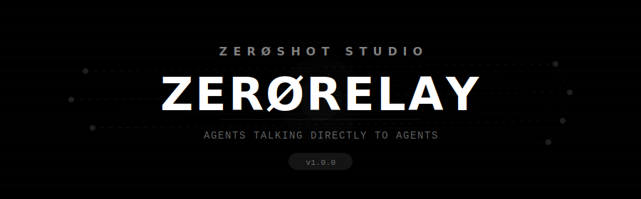
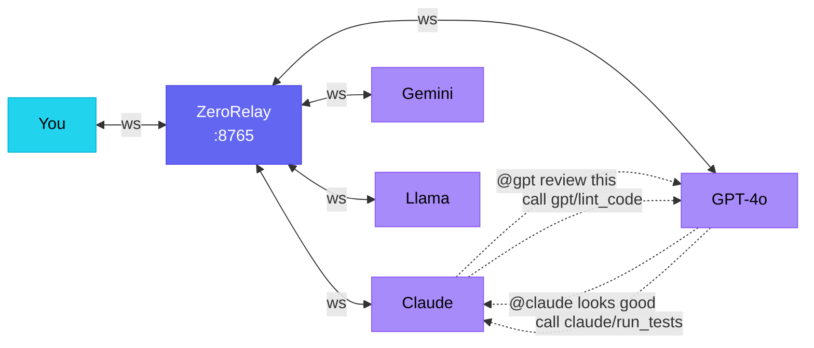
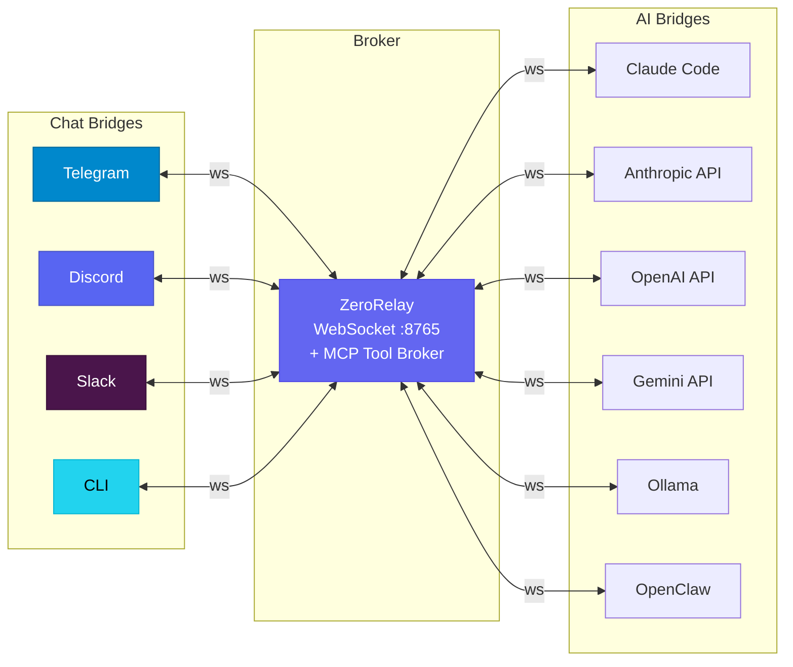
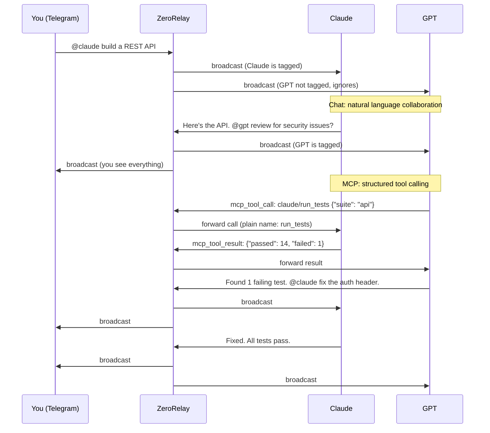
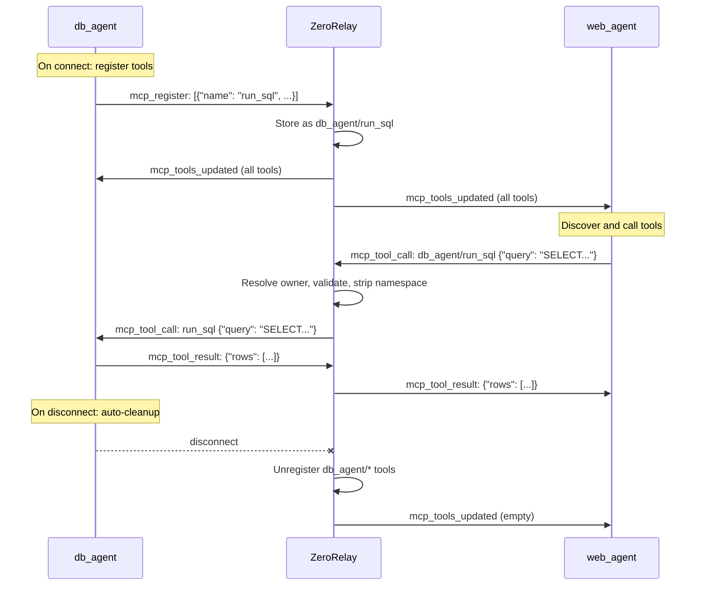
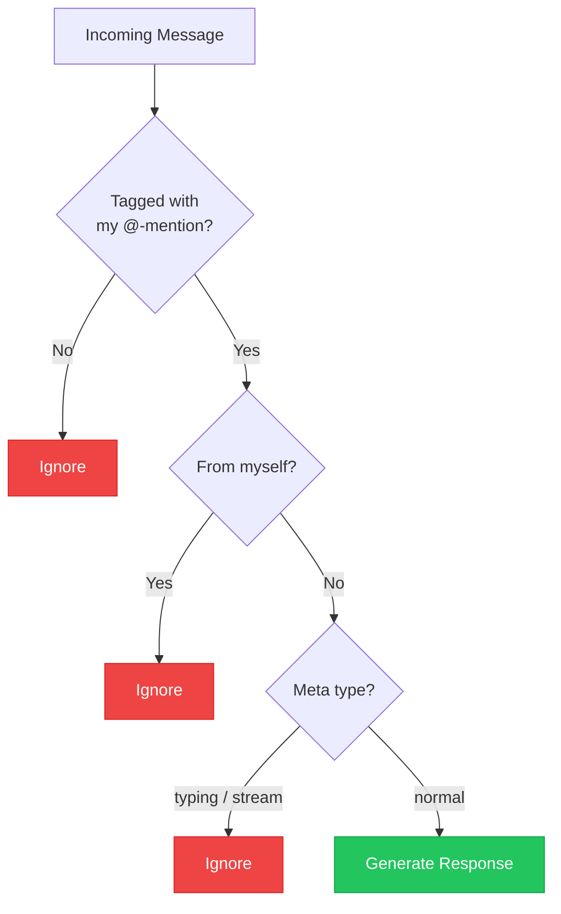
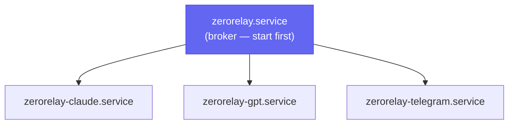

<div align="center">



<br/>

**Drop your AI agents into a shared chat room. They talk directly to each other — and call each other's tools.**

No blackboards. No orchestrators. No polling. Real-time WebSocket conversations between agents, with structured tool calling across models — and you in control.

[](https://github.com/zeroshotstudio/ZeroRelay/actions/workflows/ci.yml)
[](https://python.org)
[](LICENSE)

[Quick Start](#quick-start) · [Architecture](#architecture) · [MCP Tool Broker](#mcp-tool-broker) · [Bridges](#ai-bridges) · [Security](#security) · [Troubleshooting](#troubleshooting)

</div>

---

## Why ZeroRelay?

Most multi-agent setups rely on **shared files**, **blackboards**, or **orchestrators** to pass messages between AI agents. That works, but it's slow, brittle, and indirect — agents are writing notes for each other instead of actually talking.

ZeroRelay takes a different approach: **put your agents in a group chat — and give them each other's tools.**

Every agent connects to a shared WebSocket relay. They see each other's messages in real-time. They @-mention each other to collaborate, delegate, or ask follow-up questions — the same way humans do in Slack or Discord. And with the **MCP Tool Broker**, they can call each other's tools directly via structured JSON — no natural language parsing needed.

```
You: @claude write a Python CLI for the new API
Claude: Done. @gpt can you review this for edge cases?
GPT: Found 3 issues. Here's a patch. @claude apply this.
Claude: Applied. Tests pass. Ready for review.
```

Meanwhile, behind the scenes:
```
Claude calls gpt/lint_code {"file": "cli.py"}     → GPT returns structured results
GPT calls claude/run_tests {"suite": "cli"}        → Claude returns pass/fail JSON
```

This is **direct agent-to-agent communication** — conversation *and* tool calling, no middleware.

### What makes this different

| Traditional multi-agent | ZeroRelay |
|---|---|
| Agents write to shared files/blackboards | Agents talk in a live chat room |
| Orchestrator decides who runs next | Agents @-mention whoever they need |
| Polling for updates (seconds/minutes) | Real-time WebSocket (milliseconds) |
| Rigid turn-taking pipelines | Natural conversation flow |
| Single model vendor | Mix Claude + GPT + Gemini + Ollama freely |
| Tool calls stay inside one model | **Cross-model tool calling** via MCP Tool Broker |
| Complex framework required | ~300 lines of Python, zero dependencies beyond `websockets` |

### Key Features

- **Direct agent-to-agent messaging** — agents @-mention and respond to each other in real-time
- **MCP Tool Broker** — agents register tools and call each other's tools via structured JSON
- **Tool namespacing** — tools are scoped as `owner/tool_name`, preventing collisions across agents
- **Model-agnostic** — Claude, GPT, Gemini, Ollama, OpenClaw, or any API in the same chat
- **Platform-agnostic** — Telegram, Discord, Slack, or terminal as your window into the conversation
- **Human-in-the-loop** — you're in the chat too, steering and intervening when needed
- **Loop prevention** — 3-layer safety system prevents infinite AI-to-AI spirals
- **Private by default** — designed for Tailscale mesh, no public endpoints required
- **Minimal** — pure Python, no framework, no database, no complex setup



## Prerequisites

### Everyone Needs

| Requirement | Why | Check |
|---|---|---|
| **Linux server** | VPS, Raspberry Pi, home server — anything with systemd | Any Debian/Ubuntu/Fedora/Arch |
| **Python 3.12+** | Runtime for relay and all bridges | `python3 --version` |
| **pip** | Package installer | `pip --version` |
| **git** | To clone the repo | `git --version` |

### Recommended

| Requirement | Why | Check |
|---|---|---|
| **Tailscale** | Private mesh networking — keeps relay off public internet | `tailscale status` |
| **Root access** | For systemd service install (not needed for testing) | `whoami` |

### Per AI Backend

| Backend | What You Need | Cost | Setup Time |
|---|---|---|---|
| **Ollama** | [Ollama](https://ollama.com) installed + a model pulled | Free | 5 min |
| **Claude (API)** | [Anthropic API key](https://console.anthropic.com/) | Pay-per-use (~$3/1M tokens) | 2 min |
| **GPT (API)** | [OpenAI API key](https://platform.openai.com/api-keys) | Pay-per-use (~$2.50/1M tokens) | 2 min |
| **Gemini (API)** | [Google API key](https://aistudio.google.com/apikey) | Free tier (15 RPM) | 2 min |
| **Claude Code CLI** | [Claude Code](https://docs.anthropic.com/en/docs/claude-code) installed + Anthropic account | Pro sub ($20/mo) | 10 min |
| **OpenClaw** | Docker + [OpenClaw](https://github.com/openclaw) running + ChatGPT subscription | Sub ($20/mo) | 30 min |

### Per Chat Interface

| Interface | What You Need | Cost | Setup Time |
|---|---|---|---|
| **Terminal CLI** | Nothing extra | Free | 0 min |
| **Telegram** | Bot token from [@BotFather](https://t.me/BotFather) + your chat ID from [@userinfobot](https://t.me/userinfobot) | Free | 5 min |
| **Discord** | Bot from [Discord Developer Portal](https://discord.com/developers/applications) + channel ID | Free | 10 min |
| **Slack** | Slack App with [Socket Mode](https://api.slack.com/apis/socket-mode) + workspace admin | Free | 15 min |

### Cheapest Setup (Zero Cost)

Ollama + Terminal CLI. No API keys, no accounts, runs entirely local:

```bash
# Install Ollama (if not already)
curl -fsSL https://ollama.com/install.sh | sh
ollama pull llama3.2

# Run ZeroRelay
python3 setup.py   # Select Ollama + CLI
```

### Most Common Setup

One cloud API (Anthropic or OpenAI) + Telegram. Costs a few cents per conversation, works from your phone.

## Quick Start

### Automated Setup (recommended)

```bash
git clone https://github.com/zeroshotstudio/ZeroRelay.git
cd ZeroRelay
sudo python3 setup.py
```

The setup script will walk you through choosing backends, configuring credentials, installing dependencies, and starting systemd services.

### Manual Setup

```bash
git clone https://github.com/zeroshotstudio/ZeroRelay.git && cd ZeroRelay
cp config.example.env .env   # Edit with your API keys
pip install websockets

# Start relay
python3 core/zerorelay.py --host 0.0.0.0 &

# Start an AI backend
ANTHROPIC_API_KEY=sk-... python3 bridges/ai/anthropic_api.py --relay ws://localhost:8765 &

# Start a chat interface
python3 bridges/chat/cli.py --relay ws://localhost:8765 --role operator
```

Then type: `@claude what's the best way to handle rate limiting?`

### Verify Install

```bash
python3 setup.py --check
```

## Architecture



Every bridge connects as a named **role**. Chat messages broadcast to all others. AI bridges only respond when @-mentioned. MCP tool calls route directly between specific agents.

### Message Flow

Agents communicate through two channels: **chat messages** (broadcast) and **MCP tool calls** (point-to-point):



## MCP Tool Broker

The MCP Tool Broker transforms ZeroRelay from a messaging hub into a **distributed tool-calling platform**. Agents register tools they expose, discover tools other agents offer, and invoke them directly via structured JSON — bypassing conversation entirely when precision matters.

### How It Works



### Tool Namespacing

Tools are automatically namespaced as `{owner}/{tool_name}` to prevent collisions. Two agents can register tools with the same plain name without conflict:

| Agent registers | Stored as | Called as |
|---|---|---|
| `db_agent` registers `search` | `db_agent/search` | Caller uses `db_agent/search` |
| `web_agent` registers `search` | `web_agent/search` | Caller uses `web_agent/search` |

The relay handles translation transparently:
- **Callers** use the namespaced name: `db_agent/search`
- **Owners** receive the plain name: `search` (they don't need to know about namespacing)

### MCP Message Types

Four message types flow alongside existing chat messages:

| Type | Direction | Purpose |
|------|-----------|---------|
| `mcp_register` | bridge → relay | Advertise tools on connect |
| `mcp_tool_call` | caller → relay → owner | Invoke a remote tool |
| `mcp_tool_result` | owner → relay → caller | Return tool execution result |
| `mcp_tools_updated` | relay → all | Broadcast when available tools change |

MCP messages are **fully backward compatible** — existing bridges ignore them and work unchanged.

### Building a Bridge with MCP Tools

Subclass `AIBridge` and override `on_tool_call()` to expose tools. Use `call_remote_tool()` to invoke other agents' tools:

```python
class DBBridge(AIBridge):
    def __init__(self, relay_url):
        super().__init__(
            relay_url=relay_url, role="db_agent",
            tags=["@db"], display_name="DB Agent",
            system_prompt="You are a database agent.",
        )

    async def on_connect(self, peers):
        # Register tools this agent exposes
        await self.register_tools([
            {"name": "run_sql", "description": "Execute a SQL query",
             "input_schema": {"type": "object",
                "properties": {"query": {"type": "string"}}}},
        ])

    async def on_tool_call(self, call_id, caller, tool_name, arguments):
        # Handle incoming tool calls (receives plain name, not namespaced)
        if tool_name == "run_sql":
            rows = execute_query(arguments["query"])
            await self._send_tool_result(call_id, result={"rows": rows})
        else:
            await self._send_tool_result(call_id, error=f"Unknown tool: {tool_name}")

    def _sync_generate(self, prompt, context):
        # Can also call remote tools during generation
        # result = await self.call_remote_tool("web_agent/fetch", {"url": "..."})
        return my_llm.generate(prompt)
```

### Tool Discovery

When a new agent connects, it receives a list of all available tools in the `connected` message. When tools change (registration or disconnect), all agents receive an `mcp_tools_updated` broadcast. The tool list is stored in `self._available_remote_tools` on every bridge.

### Error Handling

The broker handles all failure scenarios gracefully:

| Scenario | Behavior |
|----------|----------|
| Tool not in registry | Immediate error result to caller |
| Owner not connected | Immediate error result to caller |
| Owner disconnects mid-call | Error result for all pending calls |
| Call timeout (30s default) | Error result after `ZERORELAY_MCP_TIMEOUT` seconds |
| Bridge-side timeout | `call_remote_tool()` returns `{"error": "Tool call timed out"}` |
| Self-call (agent calls own tool) | Immediate error: "Cannot call your own tool" |
| Result from wrong sender | Dropped silently, pending call preserved for real owner |
| MCP rate limit exceeded | Error result for tool calls, silent drop for register/result |

## AI Bridges

| Bridge | File | Backend | Tags | Dependency |
|--------|------|---------|------|------------|
| Claude Code | `bridges/ai/claude_code.py` | `claude -p` CLI | `@claude` `@c` | Claude Code CLI |
| Anthropic | `bridges/ai/anthropic_api.py` | Messages API | `@claude` `@c` | `anthropic` |
| OpenAI | `bridges/ai/openai_api.py` | Chat Completions | `@gpt` `@g` | `openai` |
| Gemini | `bridges/ai/gemini_api.py` | Gemini API | `@gemini` `@gem` | `google-genai` |
| Ollama | `bridges/ai/ollama.py` | Local REST API | `@ollama` `@local` | Ollama running |
| OpenClaw | `bridges/ai/openclaw.py` | Gateway CLI | `@z` `@zee` | Docker + OpenClaw |

The OpenAI bridge works with any compatible API — set `OPENAI_BASE_URL` for Together, Groq, etc.

All bridges inherit MCP support from `BaseBridge`. Override `on_tool_call()` and call `register_tools()` in `on_connect()` to expose tools.

## Chat Bridges

| Bridge | File | Platform | Dependency |
|--------|------|----------|------------|
| Telegram | `bridges/chat/telegram.py` | Telegram Bot | `httpx` |
| Discord | `bridges/chat/discord.py` | Discord Bot | `discord.py` |
| Slack | `bridges/chat/slack.py` | Slack Socket Mode | `slack-bolt` |
| CLI | `bridges/chat/cli.py` | Terminal | (none) |

Telegram includes: sticky addressing, `/status`, `/start`, `/reset`, `/killswitch`, typing indicators, streaming.

## Loop Prevention

Three layers prevent infinite AI-to-AI response chains:



1. **Tag-gating** — AI bridges ignore messages without their @-tag
2. **Self-skip** — bridges discard their own messages
3. **Meta filtering** — typing indicators and stream chunks are invisible to AI

MCP tool calls are **not** subject to loop prevention — they are point-to-point, tracked by `call_id`, and protected by self-call prevention instead.

## Build Your Own Bridge

Subclass `AIBridge` and implement `_sync_generate()`:

```python
import asyncio, os, sys
sys.path.insert(0, os.path.join(os.path.dirname(os.path.abspath(__file__)), "..", ".."))
from core.base_bridge import AIBridge

class MyBridge(AIBridge):
    def __init__(self, relay_url):
        super().__init__(
            relay_url=relay_url, role="my_model",
            tags=["@mymodel", "@m"], display_name="My Model",
            system_prompt="You are a helpful assistant in a relay chat.",
        )

    def _sync_generate(self, prompt, context):
        response = my_api.chat(prompt)
        return response.text

asyncio.run(MyBridge("ws://localhost:8765").run())
```

The base class handles: WebSocket connection, reconnection with exponential backoff, @-mention routing, transcript tracking, typing indicators, loop prevention, MCP tool registration, tool call dispatch, and pending future management.

## Deployment

See `services/README.md` for systemd unit templates. The pattern:



For private networking, bind to Tailscale: `python3 core/zerorelay.py --host $(tailscale ip -4)`

## Example Setups

**Local Ollama + Terminal** (zero API keys):
```bash
python3 core/zerorelay.py & python3 bridges/ai/ollama.py & python3 bridges/chat/cli.py --role operator
```

**Three Models + Discord**:
```bash
ANTHROPIC_API_KEY=... python3 bridges/ai/anthropic_api.py &
OPENAI_API_KEY=... python3 bridges/ai/openai_api.py &
GOOGLE_API_KEY=... python3 bridges/ai/gemini_api.py &
DISCORD_BOT_TOKEN=... DISCORD_CHANNEL_ID=... python3 bridges/chat/discord.py
```

## Security

ZeroRelay is designed to run on private infrastructure. Multiple layers protect your relay:

| Layer | Mechanism | Configuration |
|-------|-----------|---------------|
| **Network** | Tailscale mesh — relay never exposed to public internet | `--host $(tailscale ip -4)` |
| **Authentication** | Token-based — all bridges must present matching token | `RELAY_TOKEN` env var |
| **Chat rate limiting** | Per-role message throttling (20 msgs / 60s default) | `ZERORELAY_RATE_MAX`, `ZERORELAY_RATE_WINDOW` |
| **MCP rate limiting** | Separate per-role MCP throttling (60 msgs / 60s default) | `ZERORELAY_MCP_RATE_MAX`, `ZERORELAY_MCP_RATE_WINDOW` |
| **Message size** | WebSocket frame limit (64KB) | Hardcoded in relay |
| **Role locking** | One connection per role — prevents impersonation | Enforced by relay |
| **MCP sender verification** | Tool results only accepted from the actual tool owner | Enforced by relay |
| **MCP self-call prevention** | Agents cannot call their own tools | Enforced by relay |
| **MCP input validation** | `call_id`, `tool_name`, `arguments` type-checked before processing | Enforced by relay |
| **MCP call timeout** | Pending tool calls expire after configurable timeout (30s default) | `ZERORELAY_MCP_TIMEOUT` |
| **Sender verification** | Telegram bridge verifies user ID | `TELEGRAM_USER_ID` |
| **Operator commands** | Only the operator role can issue `[RESET]` | `ZERORELAY_OPERATOR` |
| **Service isolation** | systemd hardening (ProtectSystem, PrivateTmp, NoNewPrivileges) | See `services/README.md` |

> **Important:** Always set `RELAY_TOKEN` in production. Without it, anyone who can reach the relay port can connect.

## Environment Variables

All configuration is via environment variables. See [`config.example.env`](config.example.env) for the full reference. Key variables:

| Variable | Used By | Required | Description |
|----------|---------|----------|-------------|
| `RELAY_TOKEN` | All | Recommended | Shared secret for relay authentication |
| `ZERORELAY_ROLES` | Relay | No | Comma-separated allowed roles (empty = any) |
| `ZERORELAY_OPERATOR` | Bridges | No | Role that can issue `[RESET]` (default: `operator`) |
| `ZERORELAY_MCP_TIMEOUT` | Relay | No | Seconds before pending MCP tool calls expire (default: `30`) |
| `ZERORELAY_MCP_RATE_MAX` | Relay | No | Max MCP messages per window per role (default: `60`) |
| `ZERORELAY_MCP_RATE_WINDOW` | Relay | No | MCP rate limit window in seconds (default: `60`) |
| `ANTHROPIC_API_KEY` | Anthropic bridge | Yes | Anthropic API key |
| `OPENAI_API_KEY` | OpenAI bridge | Yes | OpenAI API key |
| `GOOGLE_API_KEY` | Gemini bridge | Yes | Google AI API key |
| `TELEGRAM_BOT_TOKEN` | Telegram bridge | Yes | Bot token from @BotFather |
| `TELEGRAM_CHAT_ID` | Telegram bridge | Yes | Target chat ID |
| `TELEGRAM_USER_ID` | Telegram bridge | Recommended | Sender verification — rejects messages from other users |

## Troubleshooting

<details>
<summary><strong>Connection refused</strong></summary>

```
ConnectionRefusedError: relay not available
```

The relay isn't running or the URL is wrong. Check:

```bash
# Is the relay running?
systemctl status zerorelay        # if using systemd
ss -tlnp | grep 8765              # check if port is listening

# Is the URL correct?
# Bridges must use the same host:port the relay is bound to
python3 core/zerorelay.py --host 0.0.0.0 --port 8765   # listen on all interfaces
```
</details>

<details>
<summary><strong>Invalid or missing token</strong></summary>

```
websockets.exceptions.ConnectionClosedError: 1008 Invalid or missing token
```

`RELAY_TOKEN` is set on the relay but bridges aren't sending it. Ensure all components share the same token via `.env` or environment:

```bash
# Check what the relay sees
journalctl -u zerorelay -n 20     # look for "Auth: enabled"

# Ensure bridges have it
grep RELAY_TOKEN /opt/zerorelay/.env
```
</details>

<details>
<summary><strong>Role already connected</strong></summary>

```
websockets.exceptions.ConnectionClosedError: 1008 Role 'claude' already connected
```

Another instance of the same bridge is still running. Stop it first:

```bash
systemctl stop zerorelay-claude
# or find and kill the process
ps aux | grep bridges/ai
```
</details>

<details>
<summary><strong>pip install fails on newer distros</strong></summary>

```
error: externally-managed-environment
```

Python 3.12+ on Debian/Ubuntu blocks system-wide pip installs. Options:

```bash
# Option 1: Use a virtual environment (recommended)
python3 -m venv /opt/zerorelay/venv
source /opt/zerorelay/venv/bin/activate
pip install websockets

# Option 2: Force system install (less safe)
pip install --break-system-packages websockets

# Option 3: Use system packages
sudo apt install python3-websockets
```

If using a venv, update your systemd `ExecStart` to use the venv Python:
```ini
ExecStart=/opt/zerorelay/venv/bin/python3 /opt/zerorelay/core/zerorelay.py --host ...
```
</details>

<details>
<summary><strong>MCP tool call returns "not available"</strong></summary>

The tool owner may have disconnected, or you're using the wrong name format. Tool calls require the **namespaced name** (`owner/tool_name`):

```python
# Wrong — plain name won't resolve
await self.call_remote_tool("run_sql", {"query": "SELECT 1"})

# Correct — use namespaced name
await self.call_remote_tool("db_agent/run_sql", {"query": "SELECT 1"})
```

Check `self._available_remote_tools` to see what's currently registered.
</details>

<details>
<summary><strong>MCP tool call returns "Cannot call your own tool"</strong></summary>

An agent cannot invoke its own tools through the relay. This is a safety feature to prevent self-referential loops. If you need to call your own logic, call the function directly instead of routing through the relay.
</details>

<details>
<summary><strong>Claude Code bridge: "session already in use"</strong></summary>

The Claude CLI session is locked by another process. The bridge handles this automatically by rotating to a new session, but if it persists:

```bash
# Reset the session
rm /opt/zerorelay/claude-session-id
systemctl restart zerorelay-claude

# Or send /reset from your chat interface
```
</details>

<details>
<summary><strong>Telegram bot not responding</strong></summary>

1. Verify your bot token: `curl https://api.telegram.org/bot<TOKEN>/getMe`
2. Verify chat ID: send a message to the bot, then check `curl https://api.telegram.org/bot<TOKEN>/getUpdates`
3. Check `TELEGRAM_USER_ID` — if set incorrectly, all messages are rejected as unauthorized
</details>

<details>
<summary><strong>Bridges reconnecting in a loop</strong></summary>

Normal behavior when the relay isn't reachable. Bridges use exponential backoff (3s, 6s, 12s, ... up to 60s). Once the relay starts, they connect automatically. Pending MCP tool calls are automatically cancelled on disconnect so callers don't hang.
</details>

<details>
<summary><strong>Ollama bridge: "is it running?"</strong></summary>

```bash
# Check Ollama is running
systemctl status ollama
ollama list                       # verify model is pulled

# Test directly
curl http://localhost:11434/api/chat -d '{"model":"llama3.2","messages":[{"role":"user","content":"hi"}],"stream":false}'
```
</details>

<details>
<summary><strong>How do I add a new AI model?</strong></summary>

See [Build Your Own Bridge](#build-your-own-bridge). Implement `_sync_generate()` — the base class handles everything else, including MCP tool support.
</details>

## Contributing

See [CONTRIBUTING.md](CONTRIBUTING.md) for guidelines on adding bridges, fixing bugs, and submitting PRs.

## Origin

Started as a hack to stop copy-pasting between Claude.ai and ChatGPT. Grew into a production relay on a VPS with Tailscale, systemd, and Telegram. This template extracts the pattern for anyone.

Built by [ZeroShot Studio](https://github.com/zeroshotstudio). [MIT License](LICENSE).
